# PotterLand

## Índice

* [1. Preámbulo](#1-preámbulo)
* [2. Perfil de Usuario](#2-perfil-de-usuario)
* [3. Problema](#3-problema)
* [4. Solución](#4-solución)
* [5. Historias de Usuario](#5-historias-de-usuario)
* [6. Decisiones de diseño](#6-decisiones-de-diseño)
* [7. Prototipos](#7-prototipos)
* [8. Test de usuarios](#8-test-de-usuarios)
* [9. Organización Trello](#9-organización-trello)
* [10. Link Google Drive](#10-link-google-drive)

***

## 1. Preámbulo

El proyecto que se mostrará a continuación, tiene como objetivo principal ser una aplicación complementaria al juego de realidad virtual “Harry Potter Wizards Unite”, salido el año 2019.
Con el fin de brindarle a nuestros usuarios la oportunidad de conocer más a fondo algunas de las características de los personajes de **Harry Potter**, aprender sobre los hechizos y pociones más importantes, así como también tendrán la oportunidad de recordar y descubrir datos curiosos de los lugares más épicos de la saga.

Link Wizards Unite web --> (https://www.wizardingworld.com/)

## 2. Perfil de Usuario

Luego de una investigación a fondo sobre el mundo de HP (películas, libros, App Wizards Unite, foros, sitio comunidad Wizards Unite), es que pudimos descubrir quiénes serán nuestros usuarios principales de PotterLand. 
Nos centramos principalmente en un perfil de usuario:
* Con un rango de edad entre los 25 a los 40 años.
* Para hombres como mujeres que les guste Harry Potter y hayan visto las películas o leído los libros.
* Esta aplicación está pensada para usuarios que tuvieron  la experiencia de jugar Wizards Unite y que no se sintieron 100% satisfechos con la App, ya que esta no va contando una historia como ellos esperarían.
* Nuestros posibles usuarios son personas muy curiosas y que desean saber más allá sobre Harry Potter y también sobre el juego.

#### 2.1 Mapa de empatía 

Para comprender mejor a nuestros usuarios, es que creamos un mapa de empatía, el cual nos ayudó a visualizar más a fondo a nuestros usuarios: reconocer sus necesidades, lo que dice y hace, vé, olle de los demás y siente, a demás de sus miedos o dolores y aspiraciones.

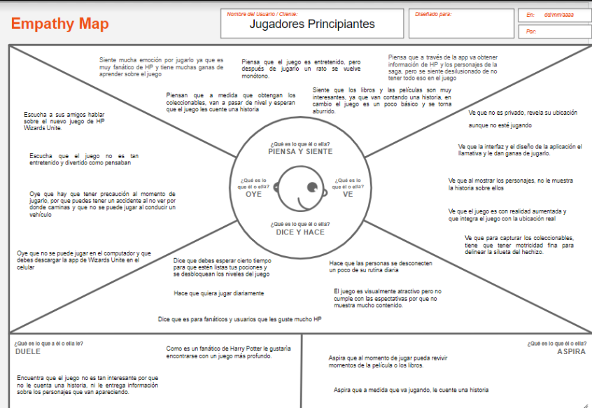

#### 2.2 Encuesta a Usuarios

Con el fin de obtener información sobre las **reales necesidades** de nuestros usuarios, es que previamente al diseño de la aplicación, se realizó la siguiente encuesta a un total de 31 personas que eran fan de Harry Potter y que no necesariamente hubiesen jugado el juego.
Como resultado se obtuvieron valiosas respuestas, las que se tomaron en cuenta para que nuestra aplicación resolviera sus principales dolores.

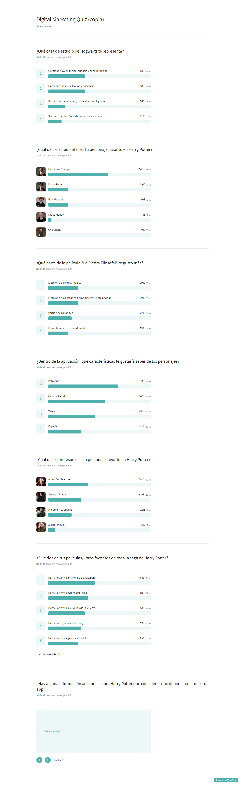

Link Encuesta-->(https://barbyfrancia.typeform.com/report/MexyARuS/6tc142pdomau3SA7)

#### 2.3 Objetivos de usuario

* El objetivo principal de nuestros usuarios, es que la aplicación sea informativa y muestre contenido sobre Harry Potter, como sus personajes,características, lugares, historias, pócimas, etc.
* Otro de los objetivos que esperan nuestros usuarios, es encontrarse con una interfaz amigable, intuitiva y que los oriente a conocer un poco más sobre el juego.
* Un último objetivo sería que esperan que se les muestre el contenido de una manera entretenida y mágica.

## 3. Problema

El principal problema de nuestros usuarios jugadores es que se encuentran con un juego de realidad virtual (Wizards Unite), que no les enseña contenido sobre los personajes ni tampoco cuenta una historia a medida que va avanzando, ésto es el principal dolor de los jugadores ya que las personas que interactúan con esta app son fans de HP, por lo que les desilusiona el hecho de que no sea tan informativa.

## 4. Solución

Para solucionar el problema de la falta de información dentro del juego, es que creamos una página informativa y complementaria para los usuarios, donde por medio de filtros,podrán acceder a los datos y encontrar los personajes con sus características respectivas, sus patronus, casas de estudios, varitas, etc.
Por otro lado la app mostrará una sección de “Tips del juego”, en donde podrán obtener información de cómo comenzar a jugar Wizards Unite, una  sección de  “Hechizos”, donde los usuarios podrán aprender sobre los hechizos más famosos de la saga y también aprender sobre pócimas  y a demás otra categoría  de “¿Sabías qué?”, la cual les mostrará datos curiosos que ocurren en las películas o los libros, como los lugares épicos, acceder al mapa de Howarts y sus alrededores, etc.
La ideación de estas categorías nacieron de la encuesta encuesta realizada a algunos posibles usuarios de la app y nos respondieron sobre qué les gustaría saber sobre HP,  para complementar el juego.

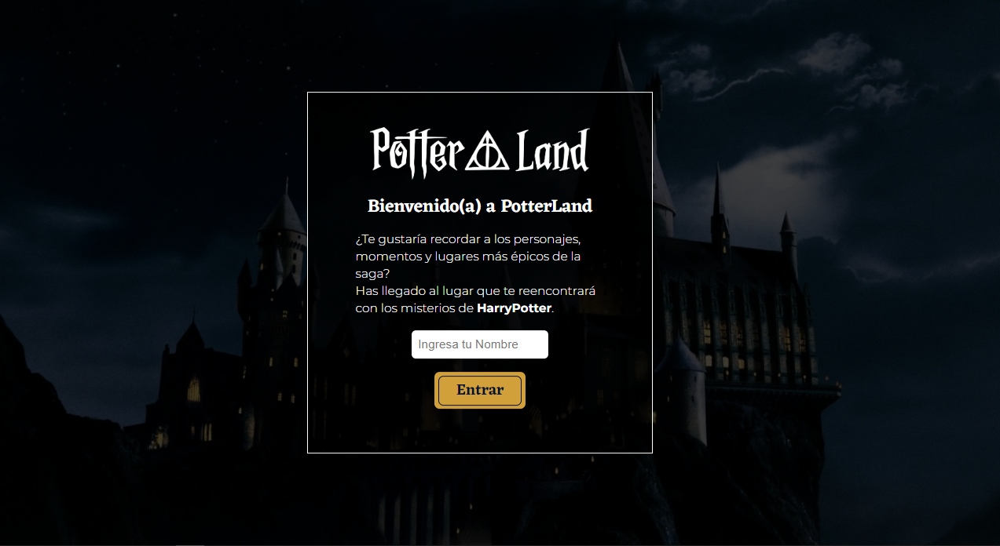

## 5. Historias de Usuario

#### 5.1 Que el usuario pueda ver todos los personajes del juego dentro de la pantalla principal.

**Criterios de Aceptación:**
* Que cada personaje se muestre dentro de un card
* Los personajes están ordenados en dos columnas por fila y hacia abajo haciendo scroll.
* Cada personaje debe contener su imagen e información respectiva
* Adaptarla a responsive

**Definición de terminado:**
* Obtener feedback de compañeras y coach para nuestro prototipo de baja fidelidad
* Obtener al menos 4 test de usuarios para nuestro prototipo navegable y poder iterar.
* Búsqueda de referentes (Wizards unite web y juego, fan pages, wikipedia, google)
* Definición del perfil de usuarios, problema, solución, objetivos e historia de usuarios. 
* Escribir el test unitario y que pase correctamente.(npm test)
* Hacer commit, pull y push.

#### 5.2 Que el usuario pueda filtrar los personajes según sus intereses

**Criterios de Aceptación:**
* Filtrarlos alfabéticamente
* Filtrarlos por casas de estudio 
* Filtrarlos por varitas
* Todos

**Definición de Terminado:**
* Escribir el test unitario y que pase correctamente.(npm test)
* Test de usuarios al prototipo navegable e iterar.
* Hacer commit, push y pull

#### 5.3 Que el usuario tenga acceso a la sección de tips de juegos

#### 5.4 Que el usuario tenga acceso a la sección de hechizos

#### 5.5 Que el usuario tenga acceso a la sección de ¿Sabías qué?

## 6. Decisiones de diseño

* Hoja de Estilos
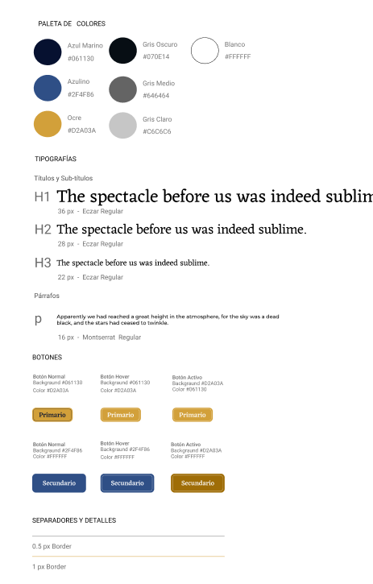

#### 6.1 Elementos visuales:

Se incorporará un estilo minimalista, pero llamativo a la vez, la intención es no saturar el sitio de elementos, para destacar la información que es lo más relevante de la página.
Se utilizarán bordes redondeados para las imágenes y los botones, para establecer una interfaz amigable y el uso de líneas delgadas para divisiones y detalles.

#### 6.2 Paleta de colores:

Se utilizarán dos colores principales:
* el **azul marino**, el cual transmite la sensación de misterio y profundidad.
* Por otro lado se utilizará el **Ocre**, el cual va con el concepto de magia y que se quiere transmitir a los usuarios y evoca el brillo caracteristico de los hechizos y también con el fin de generar un contraste y de destacar algunos elementos.
* Además se utilizará la **Escala de grises** para ayudar al contraste, dependiendo cual sea la necesidad.
Para darle un aire de misterio a la aplicación es que se tomó la decisión de utilizar un gris oscuro de fondo, y encima de este los demás elementos.

#### 6.3 Tipografía:
Se decidió utilizar una tipografía serif, llamada **Eczar**, ya que evoca al concepto de la magia y la historia, esta fuente será utilizada para títulos y Subtítulos ya que es llamativa.
Por otro lado se decidió utilizar una tipografía San-serif para los textos llamada **Monserrat**, la cual es muy amigable a la vista del  usuario ya que facilita la lectura en la web.

## 7. Prototipos

#### 7.1 Sketch 

* Dibujo a lápiz y papel
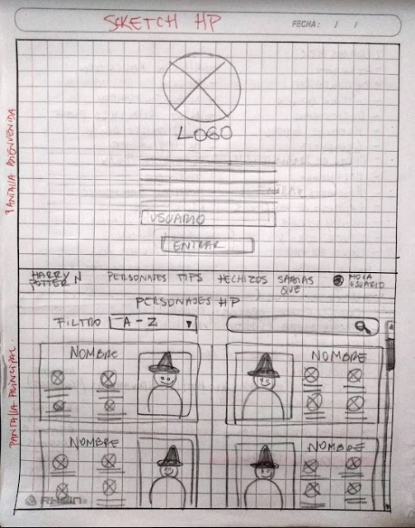

#### 7.2 Prototipo baja fidelidad- Invision

* Pantalla Bienvenida
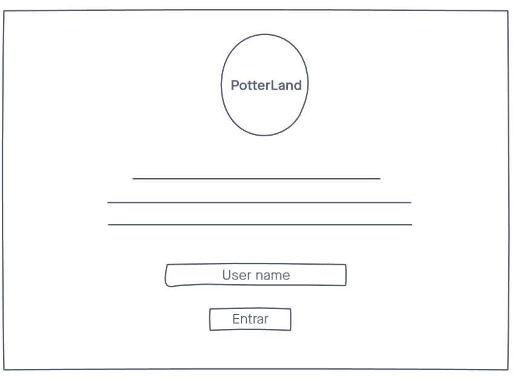

* Pantalla Principal - Filtro
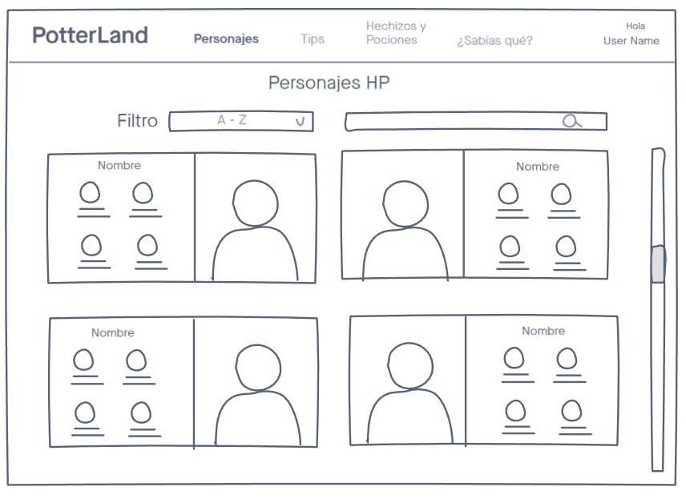

* Sección Hechizos
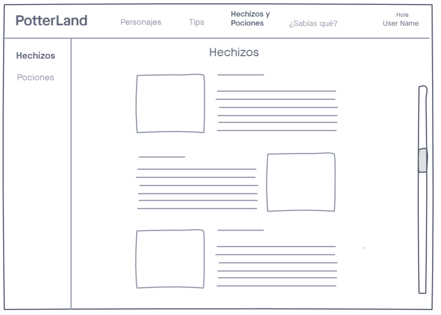

* Sección Tips del Juego
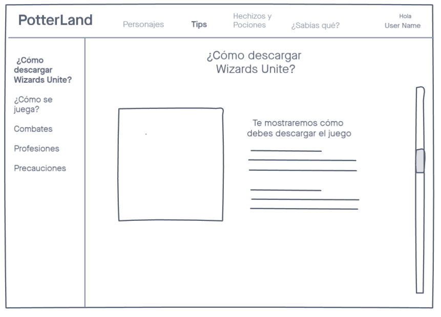

* Sección ¿Sabías qué?
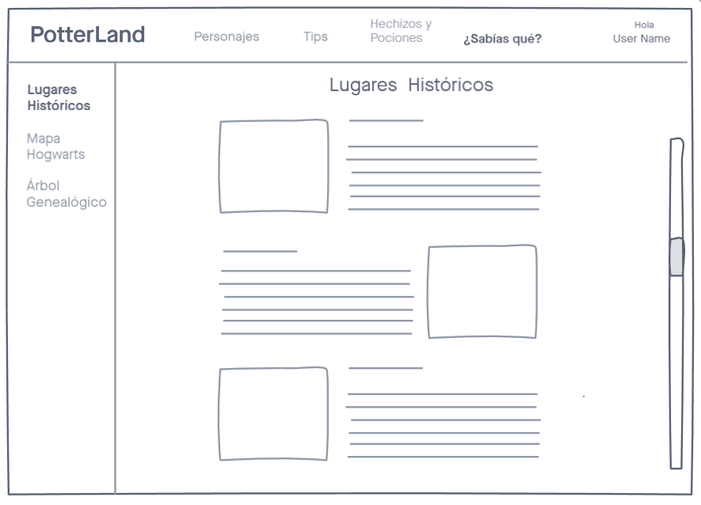

Link Invision --> (https://natalia765201.invisionapp.com/freehand/App-Harry-Potter-qeoVOb3xp)

#### 7.3 Prototipo alta fidelidad y navegable- Figma

* Pantalla Principal - Filtro personajes
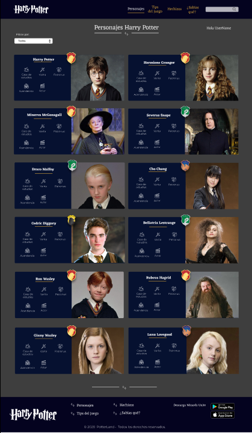

Link Figma --> (https://www.figma.com/file/ozArcDDI8mD3WwcBE8yr9t/Proyecto-Harry-Potter?node-id=34%3A0)

## 8. Test de usuarios

Con el prototipo de alta ya diseñado en figma, se hizo navegable, con la intención de hacer **pruebas**de la interfaz y de si se estaba entendiendo bien el diseño.
Se realizaron 4 test de usuarios, de los cuales pudimos rescatar un muy buen feedback para poder hacer una **iteración**.
Las tareas principales que se les pidió realizar a nuestros usuarios fueron:
* Que al momento de ingresar pudiese detectar a un personaje que le diremos
* Que pudiera filtrar por casa de estudios

**Feedback Test de Usuarios**
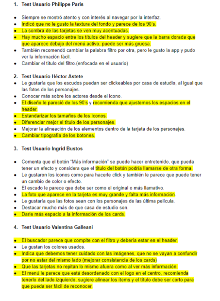

## 9. Organización -Trello 

Link Trello -->(https://trello.com/b/nxcIBMUn/proyecto-datalovers-3)

## 10. Link Google Drive

Link Trello -->(https://drive.google.com/drive/folders/1LPupZMUn6PSBk1QgMRhpIbjau87S06Tk?usp=sharing)

